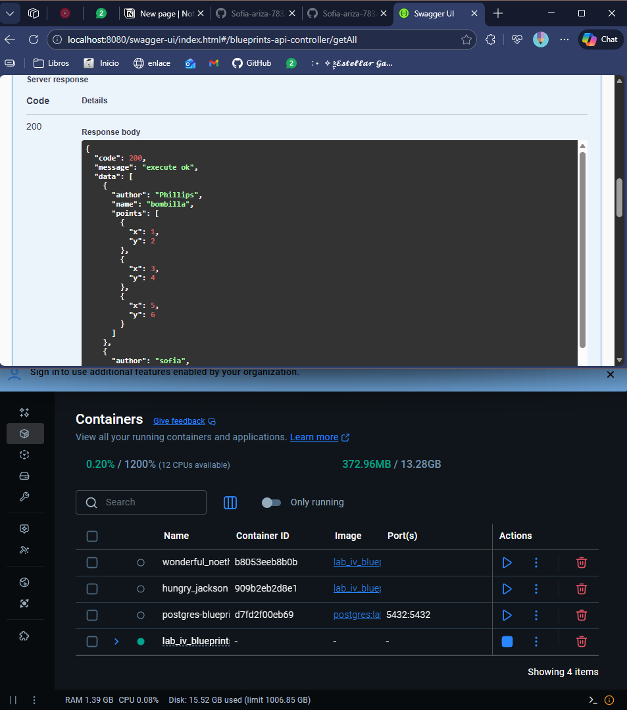
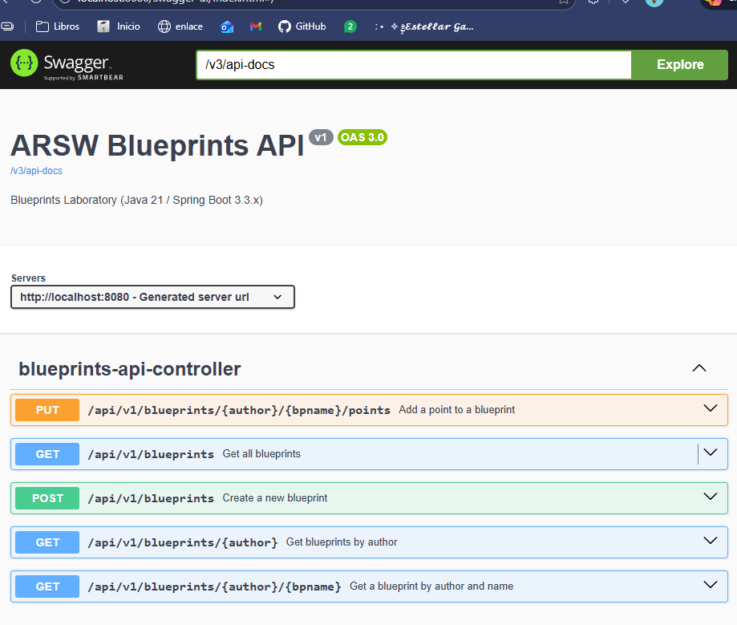
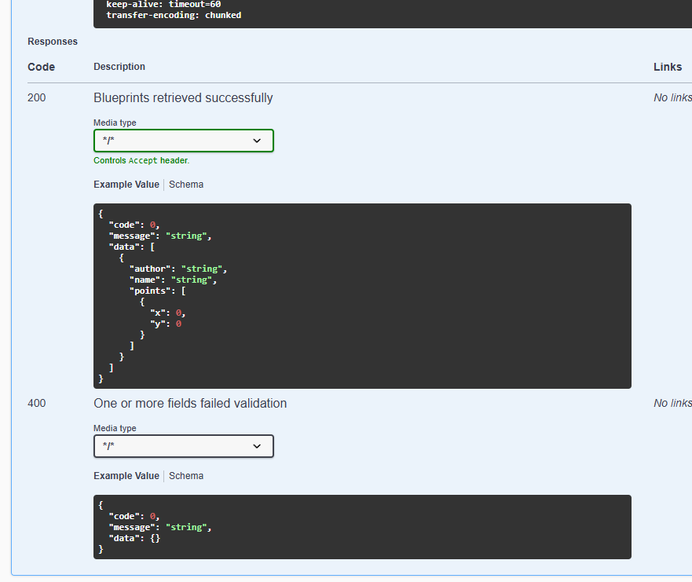
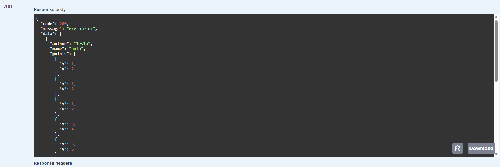
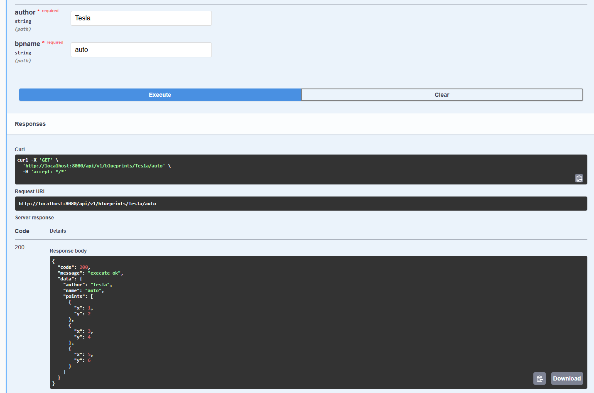
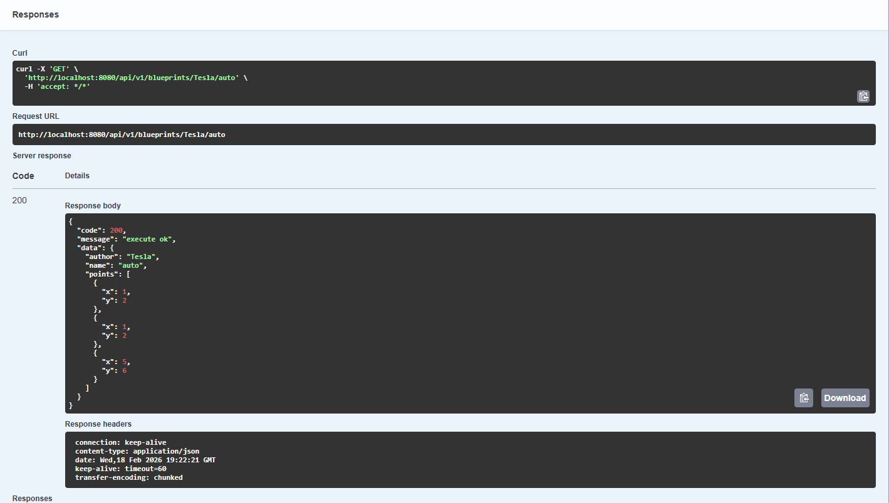

# ╰┈➤ 【🌐】 | Lab IV: BluePrints ┆⤿⌗  
### *Escuela Colombiana de Ingeniería – Arquitecturas de Software*  

---

## ╰┈➤ °.⭑【📋】 Requisitos ┆⤿⌗

- **Java 21**  
- **Maven 3.9+**  
- **Docker Desktop**

---

## ╰┈➤ °.⭑【▶️】 Ejecución del proyecto ┆⤿⌗

Para ejecutar el proyecto, asegúrate de tener **Docker Desktop instalado y en ejecución**. Luego usa:

```bash
mvn clean install
docker compose up --build
```

> Si deseas activar filtros de puntos (reducción de redundancia, *undersampling*, etc.), implementa nuevas clases que extiendan `BlueprintsFilter` y reemplaza `IdentityFilter` mediante `@Primary` o configuraciones de Spring.

### Acceso en navegador:

*   **Swagger UI:** <http://localhost:8080/swagger-ui.html>
*   **OpenAPI JSON:** <http://localhost:8080/v3/api-docs>

***

## ╰┈➤ °.⭑【🗂️】 Estructura de carpetas (arquitectura) ┆⤿⌗

    src/main/java/edu/eci/arsw/blueprints
      ├── model/         # Entidades de dominio: Blueprint, Point
      ├── persistence/   # Interfaz + repositorios (InMemory, Postgres)
      │    └── old/      # Implementaciones antiguas previas a la migración
      │    └── impl/     # Implementaciones concretas para PostgreSQL
      ├── services/      # Lógica de negocio y orquestación
      ├── filters/       # Filtros de procesamiento (Identity, Redundancy, Undersampling)
      ├── controllers/   # REST Controllers (BlueprintsAPIController)
      └── config/        # Configuración (Swagger/OpenAPI, etc.)

> La estructura sigue el patrón de **capas lógicas**, permitiendo extender el sistema hacia nuevas tecnologías o fuentes de datos.

***

## ╰┈➤ °.⭑【📖】 Actividades del laboratorio ┆⤿⌗

### 1. Familiarización con el código base

*   Revisión del paquete `model` con las clases `Blueprint` y `Point`.
*   Análisis de la capa `persistence` y su implementación `InMemoryBlueprintPersistence`.
*   Estudio de la capa `services` (`BlueprintsServices`) y del controlador `BlueprintsAPIController`.

El código actual implementa una API para gestionar *blueprints* y sus puntos, organizados por autor y nombre. La persistencia es temporal, almacenada en un mapa en memoria; esto permite simular almacenamiento persistente usando datos iniciales predefinidos.

Dado que el diseño es extensible y limpio, la migración hacia una base de datos real requiere cambios mínimos, pues ya existen los contratos necesarios para los repositorios.

***

### 2. Migración a persistencia en PostgreSQL

*   Configurar PostgreSQL (recomendado: Docker).
*   Implementar `PostgresBlueprintPersistence` reemplazando la versión en memoria.
*   Mantener el contrato definido en `BlueprintPersistence`.

Se utilizó Docker por su facilidad de despliegue. Se generaron los archivos base con:

```bash
docker init
```

A partir de esto se configuró el `Dockerfile` y `compose.yaml`, definiendo:

*   Puerto del contenedor PostgreSQL: **5432**
*   Puerto del servicio Spring Boot: **8080**
*   Variables de autenticación básicas (solo para pruebas).

Después se implementó el repositorio `PostgresBlueprintPersistence`, manteniendo la interfaz original y creando un repositorio que extiende `JpaRepository`.

En esta versión no se inicializaron datos por defecto, ya que la persistencia ahora es real y se mantiene entre sesiones.



***

### 3. Buenas prácticas de API REST
- Cambia el path base de los controladores a `/api/v1/blueprints`.
- Usa **códigos HTTP** correctos:
    - `200 OK` (consultas exitosas).
    - `201 Created` (creación).
    - `202 Accepted` (actualizaciones).
    - `400 Bad Request` (datos inválidos).
    - `404 Not Found` (recurso inexistente).
- Implementa una clase genérica de respuesta uniforme:
  ```java
  public record ApiResponse<T>(int code, String message, T data) {}
  ```
  Ejemplo JSON:
  ```json
  {
    "code": 200,
    "message": "execute ok",
    "data": { "author": "john", "name": "house", "points": [...] }
  }
  ```

La actualización del path base, se realizo directamente en el controlador, cuando se define el PathMapping. Modificando todos los paths de los endpoints actuales, y los que se podrian generar a futuro.

Para la implementacion de los codigos y de la respuesta uniforme, se implemento la clase `ApiResponseFormated` que se encarga de la creacion de la respuesta y el manejo de los codigos HTTP indicados (No utilizamos el nombre recomendado porque interferia con una de las anotaciones de documentacion). Se implementaron try-catch para manejar los errores y devolver la respuesta correcta segun correspondiera (400 0 404). Para cada uno de los endpoints se especifico cual tipo de mensaje de verificacion correcta debia enviar (200, 201, 202).
***

### 4. OpenAPI / Swagger

*   Configuración de `springdoc-openapi`.
*   Documentación accesible en `/swagger-ui.html`.
*   Anotación de endpoints con `@Operation` y `@ApiResponse`.

Para mejorar la documentación, se utilizó la anotación @Operation y @ApiResponse para cada endpoint, especificando el path, el método, el código de respuesta y la respuesta esperada. De esta forma al abrir swagger-ui y navegar a /v3/api-docs podemos ver en cada endpoint la documentación correspondiente.





***

### 5. Filtros de *Blueprints*
- Implementa filtros:
    - **RedundancyFilter**: elimina puntos duplicados consecutivos.
    - **UndersamplingFilter**: conserva 1 de cada 2 puntos.
- Activa los filtros mediante perfiles de Spring (`redundancy`, `undersampling`).

Se realizaron los cambios necesarios para que las actuales implementaciones de filtros funcionen correctamente. Se agregó al filtro base "Identity Filter" la notación de @Profile ("!redundancy && !undersampling") para que solo se aplique cuando ninguno de los otros perfiles esté activo. Y en la configuración de la aplicación se definió qué filtro activar para diferentes pruebas, como se muestran a continuación:

#### Get original



#### Get con filtro **redundancy**



#### Get con filtro **undersampling**



***

## ✅ Entregables

1.  Repositorio GitHub con:
    *   Código actualizado
    *   Configuración PostgreSQL
    *   Swagger/OpenAPI habilitado
    *   Implementación de `ApiResponse<T>`

2.  Documentación del laboratorio:
    *   Instrucciones claras
    *   Evidencia en Swagger y base de datos
    *   Explicación de buenas prácticas adoptadas

***

## 📊 Criterios de evaluación

| Criterio                         | Peso |
| -------------------------------- | ---- |
| Diseño de API                    | 25%  |
| Migración a PostgreSQL           | 25%  |
| Manejo de códigos HTTP           | 20%  |
| Documentación (OpenAPI + README) | 15%  |
| Pruebas básicas                  | 15%  |

**Bonus:**

*   Imagen de contenedor (`spring-boot:build-image`)
*   Métricas con Actuator
